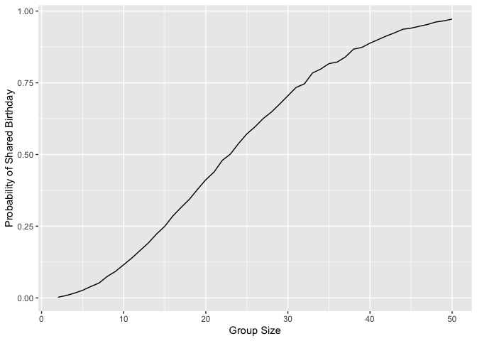
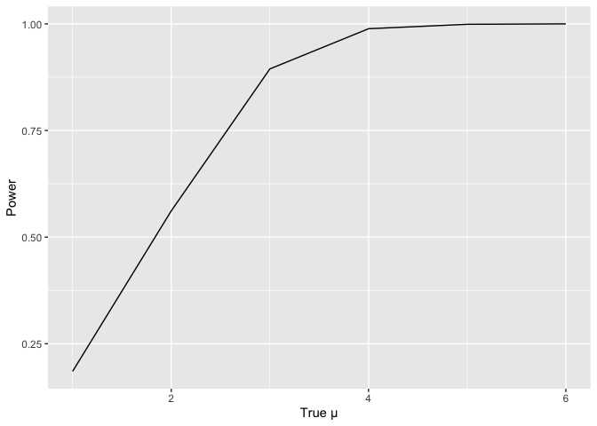
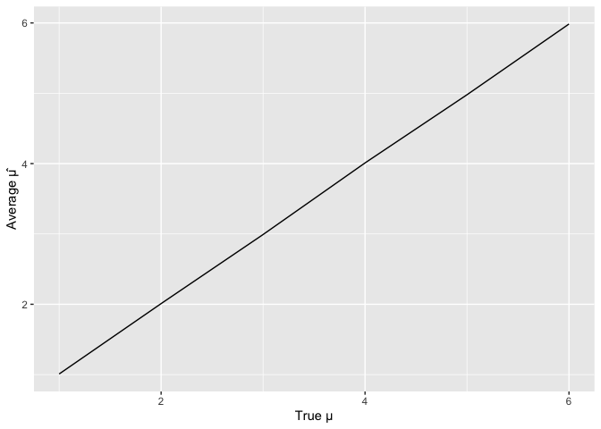

p8105_hw5_nh2796
================
2024-11-14

# Problem 1

``` r
simulate_birthdays <- function(n) {
  birthdays <- sample(1:365, n, replace = TRUE)
  return(length(birthdays) > length(unique(birthdays)))
}
```

``` r
set.seed(1)
probabilities <- numeric(49)

for (n in 2:50) {
  results <- numeric(10000)
  for (i in 1:10000) {
    results[i] <- simulate_birthdays(n)
  }
  probabilities[n - 1] <- mean(results)
}
```

``` r
data <- data.frame(group_size = 2:50, probability = probabilities)
ggplot(data, aes(x = group_size, y = probability)) + 
  geom_line() + 
  labs(x = "Group Size", y = "Probability of Shared Birthday")
```

<!-- -->

# Problem 2

``` r
set.seed(123)
n <- 30
sigma <- 5
mu_values <- 1:6

results <- list()

for (mu in mu_values) {
  mu_results <- matrix(NA, nrow = 5000, ncol = 2)  
  for (i in 1:5000) {
    data <- rnorm(n, mean = mu, sd = sigma)
    test <- t.test(data, mu = 0)
    mu_results[i, 1] <- test$estimate
    mu_results[i, 2] <- test$p.value
  }
  results[[as.character(mu)]] <- mu_results
}
```

``` r
power = numeric(length(mu_values))
mean_mu_hat = numeric(length(mu_values))

for (i in 1:length(mu_values)) {
  mu_result <- results[[as.character(mu_values[i])]]
  power[i] <- mean(mu_result[, 2] < 0.05)  
  mean_mu_hat[i] <- mean(mu_result[, 1])  
}
```

``` r
data = 
  data.frame(mu = mu_values, power = power)

ggplot(data, aes(x = mu, y = power)) +
  geom_line() +
  labs(x = "True µ", y = "Power")
```

<!-- -->

``` r
data_mu_hat <- data.frame(mu = mu_values, estimate = mean_mu_hat)

ggplot(data_mu_hat, aes(x = mu, y = estimate)) +
  geom_line() +
  labs(x = "True µ", y = "Average µ̂")
```

<!-- -->
